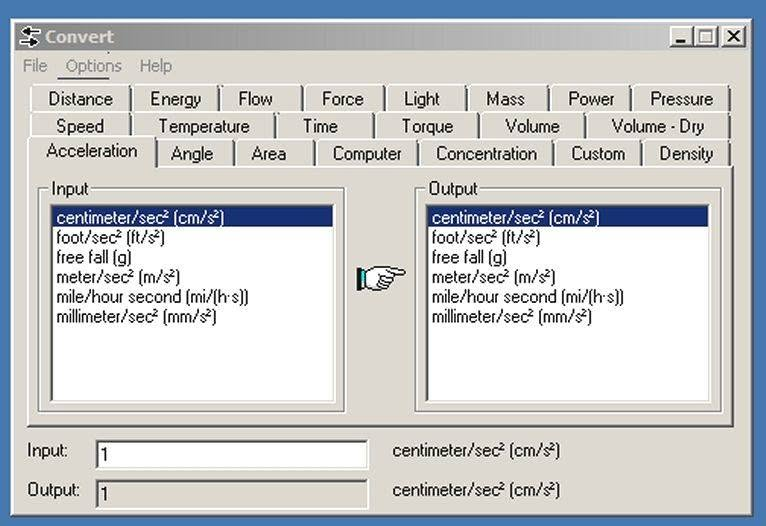

#  Unit Converter

A local, fully offline unit converter skill for OVOS - no cloud
dependency, no API key. Conversion math is done with
[pint](https://pint.readthedocs.io/), spoken numbers are parsed with
[ovos-number-parser](https://github.com/OpenVoiceOS/ovos-number-parser).

[](https://github.com/andlo/ovos-skill-convert/actions/workflows/test.yml)
[](https://pypi.org/project/ovos-skill-convert/)

> **This is an early-stage scaffold (0.0.x).** 18 of 21 categories from
> the original brief are wired up. It's not ready for the OVOS Skill
> Store yet - see "Status" below.

## Why this exists



Back in the day, most Windows PCs had a little utility like this one -
a simple offline converter with tabs for every unit category you could
think of (distance, mass, temperature, volume, and so on), no internet
connection required. This skill is the voice-assistant equivalent of
that program: local, offline, no account, no API key, just "convert X
to Y".

There's a Wolfram Alpha plugin/skill in the OVOS ecosystem
(`ovos-wolfram-alpha-plugin` / `ovos-skill-wolfie`) that covers unit
conversion as part of a much broader "single-answer question" tool -
but it requires an internet connection and a Wolfram Alpha API key.
Nothing in the ecosystem does *just* unit conversion, locally, with no
dependency on a cloud service. This fills that gap.

## Install
```bash
pip install ovos-skill-convert
```

## Usage
```
"convert 10 centimeters to inches"
"how many feet is 2 meters"
"konverter 10 centimeter til tommer"      (Danish)
"hvor mange fod er 2 meter"               (Danish)
```

## Status

**Implemented (18 categories, ~300 verified aliases across en-us +
da-dk):** length, mass, temperature, time, speed, area, volume,
volume_dry (en-us only), angle, density, pressure, force, energy,
power, torque, acceleration, concentration, computer, flow.

**Deliberately not implemented:**
- **Light** - this version of `pint` has no foot-candle/phot units,
  and lumen/lux/candela are three different dimensions that aren't
  directly interconvertible, so there's nothing meaningful to build
  without adding custom unit definitions.
- **Custom** - the original program's user-defined-unit tab. Doesn't
  map onto a voice interface.

Every unit string in `locale/en-us/unit_aliases.json` was checked
against the installed `pint` registry before being added (see
`DEVELOPMENT.md` for the verification method) - none of it is guessed.

Unit aliases live in `locale/<lang>/unit_aliases.json` per language,
not hardcoded in Python - see "Adding a new unit category or language"
in `DEVELOPMENT.md` for how to add a new language via the same
`ovos-localize` workflow used for the rest of this project's locale
content.

### False-friend traps found and handled

A few unit names collide across languages/contexts with a *different*
real-world value - each is called out in that language's
`unit_aliases.json` `"_notes"` key:

| Word | Wrong assumption | Correct handling |
|---|---|---|
| Danish "mil" | = English "mile" | It's the Scandinavian mile (10 km) - omitted, not mapped |
| Danish "ton" | = pint's bare `ton` (US short ton, 907 kg) | Mapped to `metric_ton` (1000 kg) - matches everyday Danish usage |
| Danish "pund" | = imperial pound (453.6 g) | It's exactly 500 g historically - omitted, not mapped |
| Danish "hk"/"hestekraft" | = pint's bare `horsepower` | Mapped to `metric_horsepower` (~1.4% different) |
| `cfm` (as an alias) | = cubic feet per minute | `pint` parses it as **centi-fermi**, an obscure length unit - spelled out in full instead |
| bare "g" | could mean gram or "free fall"/gravity | Only ever aliased to gram; acceleration uses "standard gravity"/"free fall" |
| bare "grader"/"degrees" (da/en) | could mean angle or temperature | Defaults to angle; temperature requires naming celsius/fahrenheit/kelvin explicitly |
| `oz` vs `fluid_ounce` | same English word, different dimension (mass vs volume) | Kept as separate keys, never merged |

A startup consistency check (`_build_merged_aliases()`) also raises an
error at import time if any two categories ever define the same spoken
alias with two *different* target units for the same language - so a
future collision like these can't ship silently.

## Architecture: why NOT Common Query

This is a regular intent skill (padatious), not a Common Query
provider. Common Query exists to pick the best answer among *multiple
skills that might plausibly answer the same question* (e.g. "what's
the capital of France"). Unit conversion has exactly one correct
answer and no competing sources to arbitrate between - routing it
through CQ would add latency and confidence-scoring machinery for a
problem that's already fully deterministic. A plain intent match with
structured slots (`value`, `from_unit`, `to_unit`) is the right tool
here.

## Unit resolution strategy

Spoken unit text is resolved in three steps:
1. Exact match against the current language's alias table.
2. Fuzzy match (`match_one`, threshold 0.8) against that same table -
   covers minor STT mishearings.
3. Fallback: try the raw text directly against `pint` (covers someone
   literally saying a unit symbol like "cm").

If none of those resolve, the skill says so rather than guessing.

## Development

See [DEVELOPMENT.md](DEVELOPMENT.md).

## Category
**Utility**

## Tags
#converter #units #measurement #utility #offline
